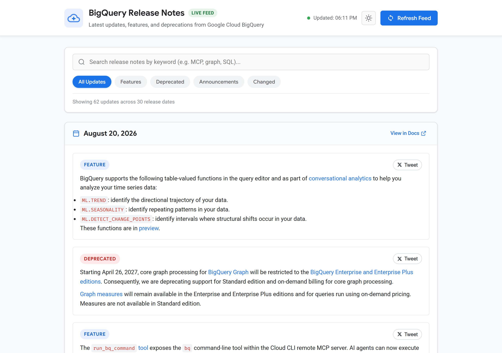
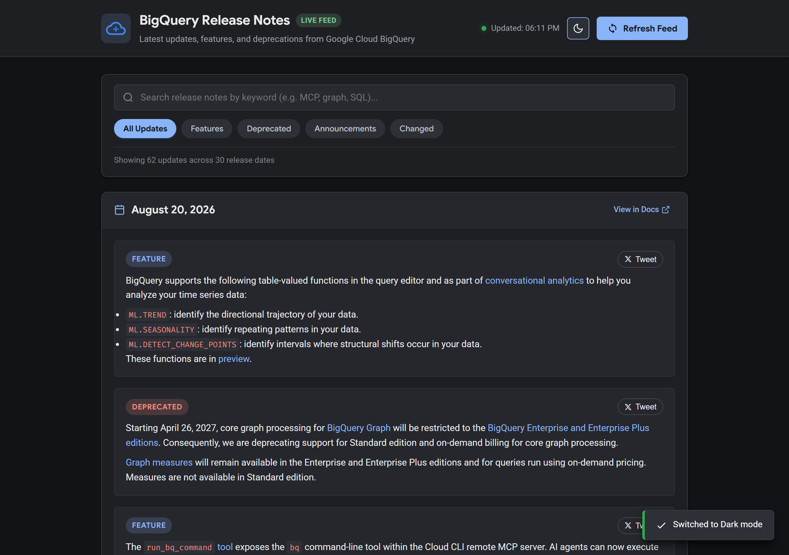
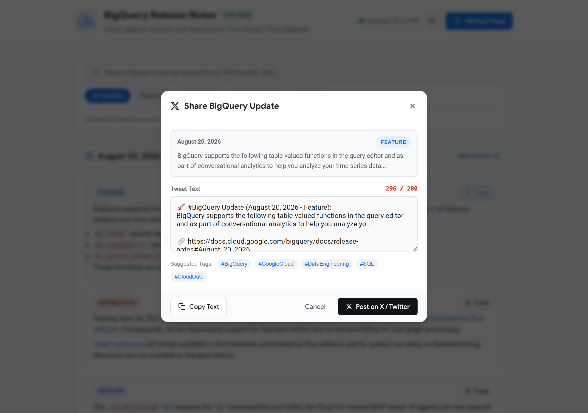
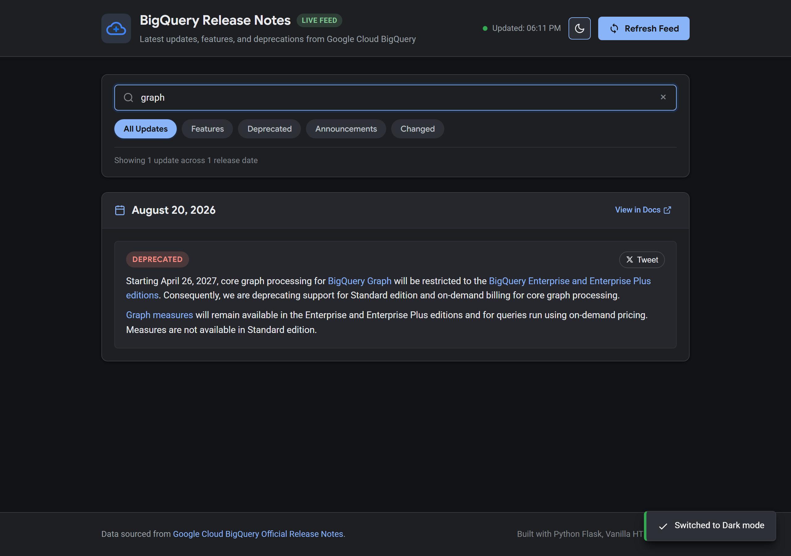

# BigQuery Release Notes Web Application

A lightweight, modern web application built with **Python Flask** and vanilla **HTML, CSS, and JavaScript** that fetches and parses the live Google Cloud BigQuery release notes feed, provides an AJAX refresh spinner, dynamic search & filtering, and lets you compose and share tweets about any specific update directly on X (Twitter).

## Features

- **Live Atom XML Feed Fetching**: Automatically parses and structures the official Google Cloud BigQuery release notes (`https://docs.cloud.google.com/feeds/bigquery-release-notes.xml`).
- **Interactive Feed UI**: Clean Google Cloud-style card design organized by release date.
- **Dark Mode UI Toggle**: Built-in dark/light theme switch with system preference detection and localStorage persistence.
- **Categorized Badges**: Categorizes updates into `Feature`, `Deprecated`, `Announcement`, `Changed`, etc.
- **Search & Category Filtering**: Instant client-side filtering by keyword or category pills.
- **AJAX Refresh with Spinner**: Instant updates without full page reloads.
- **Tweet Any Update**: Click "Tweet" on any specific update to open a pre-populated composer modal with character limits, hashtag suggestions, clipboard copy, and one-click posting to X/Twitter via Web Intent.
- **Zero Heavy Frontend Frameworks**: 100% vanilla HTML5, CSS3, and modern JavaScript.

## Screenshots

### ☀️ Light Mode & Feed Overview


### 🌙 Dark Mode Interface


### 🐦 Share on X (Twitter) Composer Modal


### 🔍 Instant Keyword Search & Category Filtering


## Setup & Running

### 1. Install Dependencies
```bash
pip install -r requirements.txt
```

### 2. Run the Web Application
```bash
python app.py
```

### 3. Open in Browser
Navigate to:
```
http://127.0.0.1:5000
```

## Running Tests
```bash
python -m unittest discover -s tests -p "test_*.py"
```

## Project Structure
```
├── app.py                # Main Flask web application & API endpoints
├── feed_parser.py        # Atom XML feed fetcher and parser
├── requirements.txt      # Python dependencies (Flask, requests)
├── templates/
│   └── index.html        # Main HTML layout and modal dialogs
├── static/
│   ├── css/
│   │   └── styles.css    # Responsive styles and animations
│   └── js/
│       └── app.js        # Vanilla JS state, AJAX fetch, filtering & Tweet logic
└── tests/
    └── test_feed.py      # Automated unit tests
```
